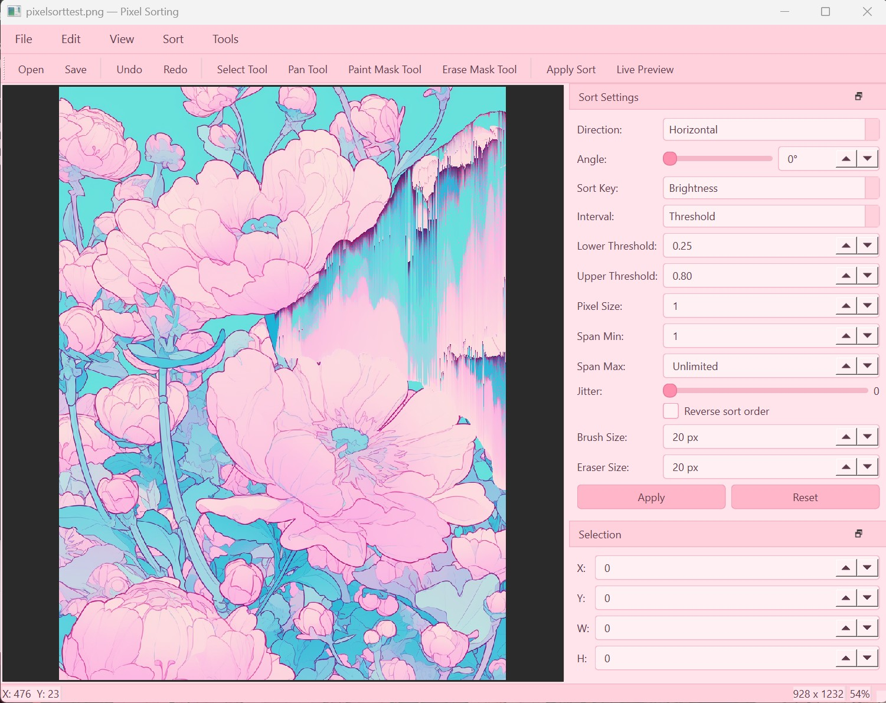

# Pixel Sorting

A desktop pixel sorting tool built with Python, PySide6, NumPy, and Pillow. Load an image, configure sorting parameters, and apply pixel sorting effects with real-time preview and full undo/redo support.



## Features

- **Multiple sort keys** — Sort pixels by brightness, hue, saturation, intensity, minimum channel, or individual R/G/B channels
- **Interval modes** — Control how pixel spans are detected: threshold, random, edges, waves, or full row
- **Angle sorting** — Sort pixels at any angle (0–360°) for diagonal and rotated effects
- **Block mode** — Group pixels into NxN blocks and sort blocks as units
- **Mask painting** — Paint a mask directly on the canvas to limit sorting to specific areas
- **Region selection** — Select a rectangular region to sort, or sort the entire image
- **Live preview** — Toggle real-time preview that updates as you adjust parameters (debounced, runs in a background thread)
- **Undo/redo** — Full undo/redo history, storing only the affected region per operation
- **Drag and drop** — Drop image files directly onto the window to open them
- **Customizable parameters** — Threshold range, span min/max, jitter, reverse order, pixel size

## Installation

Requires Python 3.10+.

```bash
pip install -r requirements.txt
```

### Dependencies

- PySide6 >= 6.5
- Pillow >= 10.0
- NumPy >= 1.24

## Usage

```bash
python main.py
```

1. Open an image via **File > Open** or drag and drop
2. Adjust sort parameters in the **Sort Settings** panel
3. Optionally draw a selection rectangle or paint a mask
4. Click **Apply** or press `Ctrl+Enter` to sort
5. Toggle **Live Preview** (`Ctrl+P`) to see changes in real time

### Keyboard Shortcuts

| Shortcut | Action |
|---|---|
| `Ctrl+O` | Open image |
| `Ctrl+S` | Save |
| `Ctrl+Shift+S` | Save As |
| `Ctrl+Z` | Undo |
| `Ctrl+Y` | Redo |
| `Ctrl+Enter` | Apply sort |
| `Ctrl+P` | Toggle live preview |
| `Ctrl+A` | Select all |
| `Escape` | Clear selection |
| `Ctrl+0` | Fit to window |
| `Ctrl+1` | Reset zoom (100%) |
| `S` | Select tool |
| `H` | Pan tool |
| `B` | Paint mask tool |
| `E` | Erase mask tool |

### Canvas Controls

- **Scroll wheel** — Zoom in/out
- **Middle-click drag** — Pan the canvas

## Project Structure

```
main.py                          # Entry point
pixelsorting/
  core/
    sort_params.py               # SortParams dataclass and enums
    sort_keys.py                 # Vectorized sort key computation (NumPy)
    span_detector.py             # Interval/span detection algorithms
    sorting_engine.py            # Core pixel sorting logic
    image_buffer.py              # Image I/O wrapper (NumPy + Pillow + QPixmap)
  ui/
    main_window.py               # Main application window
    canvas_view.py               # QGraphicsView with pan, zoom, selection, mask
    canvas_scene.py              # QGraphicsScene for image display
    settings_panel.py            # Sort parameter controls (dock widget)
    coordinate_input.py          # Selection coordinate input (dock widget)
    context_menu.py              # Right-click context menu
  commands/
    sort_command.py              # QUndoCommand + SortWorker QThread
```

## License

All rights reserved.
